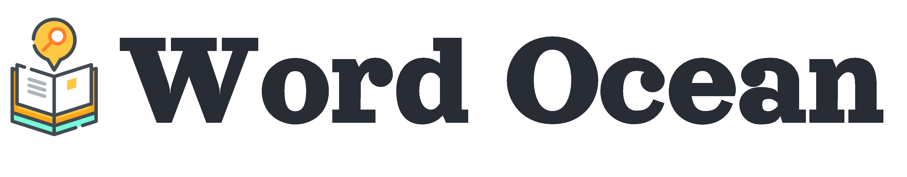

<!-- # Word Ocean -->

   
  
  <!--   -->
  <!-- Word Ocean -->
  <!--   -->

<h2 align="center">Lookup word definitions and additional information in different languages.</h2>
<!--   -->

## How To Use

Open the [word ocean website](https://timii.github.io/WordOcean/), choose one of the languages from [supported languages](#supported-languages), enter the word you want to know the definition of and press "Search". The results will be shown below.

   
  

 

## Run locally

- clone/download this repo,
- run `npm install` inside the downloaded folder to install all the dependencies,
- after all the dependencies are installed run `npm start`

After a short time the site opens automatically in your browser.

## How It Works

It uses the [freeDictionaryAPI](https://dictionaryapi.dev/) to get the information for the word in the corresponding language.

## Supported Languages

- English (US)
- Spanish
- French
- Japanese
- Russian
- English (UK)
- German
- Italian
- Korean
- Brazilian Portuguese
- Arabic
- Turkish
- Hindi
